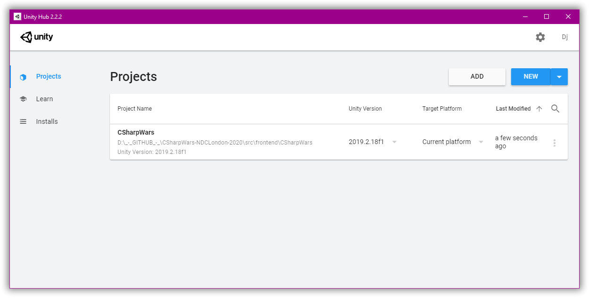

# CSharpWars


[Return to README](https://github.com/Djohnnie/CSharpWars-NDCLondon-2020)
[Return to step 2](https://github.com/Djohnnie/CSharpWars-NDCLondon-2020/tree/master/workshop/step02)

## Step 2

Open the backend solution in Visual Studio 2019 or Visual Studio Code

```
.\CSharpWars-NDCLondon-2020\src\backend\CSharpWars\CSharpWars.sln
```

This solution contains multiple projects for both the ASP.NET Core 3.1 WebApi backend and the .NET Core 3.1 middleware worker service. 
* *CSharpWars.Web.Api*: The ASP.NET Core 3.1 WebApi application.
* *CSharpWars.Processor*: The .NET Core 3.1 middleware worker service.
* *CSharpWars.Scripting*: A project containing the Microsoft Compiler Platform (Roslyn) logic.
* *CSharpWars.Logic*: A project containing all business logic for the entire project.
* *CSharpWars.DataAccess*: A project containing the Entity Framework Core 3.1 DbContext and migrations.
* *CSharpWars.Enums*: A project containing enums. These are seperated because they are also used in the Microsoft Compiler Platform (Roslyn) logic.
* *CSharpWars.Model*: A project containing model classes, used by Entity Framework, but also by the WebApi and middleware.
* *CSharpWars.Common*: A project containing common code like configuration, extension methods, helper classes and tools.

Open the frontend Unity project by adding the folder to the projects page of the Unity Hub and clicking the project tile.



The left hand side of the Unity workspace contains your current scene. Browse the project structure in the bottom and find the *MainScene* in the *Scenes* folder and double-click this to make it the actively selected scene. You should now see a cube in the active Scene visualization window.

Pressing the *play* button, located on top, will run your active scene and you should see the cube floating in space with a static camera.

[Continue to step 3](https://github.com/Djohnnie/CSharpWars-NDCLondon-2020/tree/master/workshop/step03)