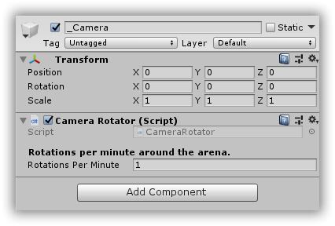

# CSharpWars


[Return to README](https://github.com/Djohnnie/CSharpWars-NDCLondon-2020)

[Return to step 3](https://github.com/Djohnnie/CSharpWars-NDCLondon-2020/blob/master/workshop/step03/step.md)

## Step 4

Let's finally start implementing some features!


Go to your opened frontend project in the Unity editor and select the *_Camera* game-object in the scene hierarchy.

In your scene preview window, you should be able to find the camera object which is selected. Try zooming out whith your mouse scroll-wheel.

On the right hand side, in the *Inspector* window, you can see the transform properties for the selected game object.

If you expand the *_Camera* game object in the scene hierarchy, you will find another *Camera* game object. This is the actual camera contained within a parent *_Camera* game object. This child-camera has different transform properties in the *Inspector* window and you'll see that its position and rotation are custom.

The parent *_Camera* game object is centered in the game world and does not have a rotation. The child *Camera* game object is positioned out-of-center and is rotated to look, slightly angeled down, at the center of the game world.

Our goal for this step would be to rotate the camera around the center of the game world, where the cube is located, and the easiest way to do this, is to rotate the parent *_Camera* game object around the Y-ax.

Go to your Visual Studio 2019 instance where you have opened the Unity frontend scripts solution and find the *CameraRotator.cs* script file.

Add the following code to make a script that enables the camera object to rotate:

```c#
using UnityEngine;

public class CameraRotator : MonoBehaviour
{
    [Header("Rotations per minute around the arena.")]
    public float RotationsPerMinute = 1.0f;

    void Update()
    {
        // yAngle (in degrees) = 6 * x * deltaTime (seconds).
        // If RotationsPerMinute is equal to 1, yAngle = 360 degrees (6 * 1 * 60).
        var yAngle = 6.0f * RotationsPerMinute * Time.deltaTime;
        transform.Rotate(0f, yAngle, 0f);
    }
}
```

The *Update* method will run with each frame-update of your game-loop and calculate the angle its needs to rotate the transform properties of your active game object. This calculation is based on the *Time.deltaTime*, or the amount of seconds since the last frame-update. This way the rotation speed is alway constant and independent of your frame-rate.

By including a public property, we are able to tweak the speed of the rotation by changing this property externally.

In order to make this script work, we need to link it to the actual *_Camera* game object. Return to the Unity editor and again select the *_Camera* game object.

In the *Inspector* window, click the *Add Component* button and find the *CameraRotator* script from the list of assets.



Pressing the play button in the top should show you the working result. You can now change the *RotationsPerMinute* property to finetune the speed of the camera, rotating the cube in the center of your game world.


[Continue to step 5](https://github.com/Djohnnie/CSharpWars-NDCLondon-2020/blob/master/workshop/step05/step.md)