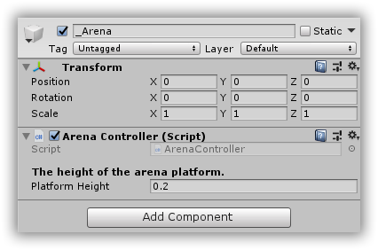

# CSharpWars


[Return to README](https://github.com/Djohnnie/CSharpWars-NDCLondon-2020)

[Return to step 4](https://github.com/Djohnnie/CSharpWars-NDCLondon-2020/blob/master/workshop/step04/step.md)

## Step 5

Next step would be to display the arena floor.

The cube in the center of the game world is the basic shape that you will transform into a flat surface and thus represent the arena floor.

The arena floor can be dynamically resized, depending on the backend configuration. Therefore we need to create a WebApi endpoint that will provide us with the dimensions for the arena.

Go to your backend solution in Visual Studio 2019 and find the *ArenaLogic.cs* file in the *CSharpWars.Logic* project.

In this file, the *GetArena* method should return the dimensions for the arena, based on the configuration. Remember that we have previously added the *ARENA_SIZE* environment variable. This was set to the number 10 so this will make our arena 10x10 in size.

Add the following code to get the dimensions from configuration:

```c#
public Task<Arena> GetArena()
{
    return Task.FromResult(new Arena
    {
        Width = _configurationHelper.ArenaSize,
        Height = _configurationHelper.ArenaSize
    });
}
```

Now start debugging the *CSharpWars.Web.Api* project and once it is running, navigate to *http://localhost:5000/api/arena* and you should see the following result:

```json
{"width":10,"height":10}
```

Now go to the Unity scripts solution in Visual Studio 2019, find the *ArenaController.cs* script and add the following code:

```c#
using Assets.Scripts.Model;
using Assets.Scripts.Networking;
using UnityEngine;

namespace Assets.Scripts.Controllers
{
    public class ArenaController : MonoBehaviour
    {
        private Arena _arena;
        private GameObject _floor;

        [Header("The height of the arena platform.")]
        public float PlatformHeight = .2f;

        void Start()
        {
            _arena = ApiClient.GetArena();
            _floor = GameObject.Find("Floor");
            _floor.transform.localScale = new Vector3(_arena.Width, PlatformHeight, _arena.Height);
            _floor.GetComponent<Renderer>().material.mainTextureScale = new Vector2(_arena.Width, _arena.Height);
        }
    }
}
```

The *Start* method will be called once, when the attached game object is loaded into the game world. In this case, it will get the arena dimensions from our backend webapi, find a child game object with the naam "Floor" and transform that with the dimensions of the arena.

The arena floor cube, which is now scaled to match the arena dimensions, and a configurable height, will also get its texture scaled. The reason for this is to tile the texture and not stretch it so we can clearly see the seperate arena tiles.

As you can see, the GetArena method on the ApiClient does not yet exist. Go find the *ApiClient.cs* file and add the following code:

```c#
using System.Collections.Generic;
using Assets.Scripts.Model;
using RestSharp;

namespace Assets.Scripts.Networking
{
    public static class ApiClient
    {
        private static readonly string _baseUrl = "http://localhost:5000/api";

        public static Arena GetArena()
        {
            return Get<Arena>("arena");
        }

        private static TResult Get<TResult>(string resource) where TResult : new()
        {
            var client = new RestClient(_baseUrl);
            var request = new RestRequest(resource, Method.GET);
            var response = client.Execute<TResult>(request);
            return response.Data;
        }
    }
}
```

Now go back to the Unity editor, select the *_Arena* game object in the scene hierarchy and link the script to the game object in the *Inspector* window by adding a component:



Clicking the play button in the top should now immediately show the arena with its correct dimensions.


[Continue to step 6](https://github.com/Djohnnie/CSharpWars-NDCLondon-2020/blob/master/workshop/step06/step.md)