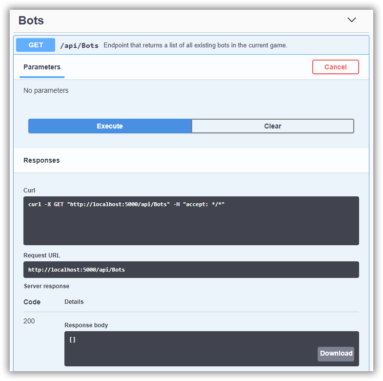

# CSharpWars


[Return to README](https://github.com/Djohnnie/CSharpWars-NDCLondon-2020)

[Return to step 5](https://github.com/Djohnnie/CSharpWars-NDCLondon-2020/blob/master/workshop/step05/step.md)

## Step 6

Now that the arena floor is available, we should be able to put robots on top of it. Before we go and do this in our Unity frontend, we will go to the Visual Studio 2019 backend solution and add the logic to get the active bots from the database.

Find the *BotLogic.cs* file in the CSharpWars.Logic project and add the following code inside the *GetBots* and *GetBotInfo* method:

```c#
public async Task<IList<Bot>> GetBots()
{
    return await _dbContext.Bots.ToListAsync();
}

public async Task<IList<BotInfo>> GetBotInfo()
{
    return await _dbContext.Bots.Select(b => new BotInfo
    {
        Id = b.Id,
        Name = b.Name,
        Orientation = b.Orientation,
        X = b.X,
        Y = b.Y,
        Move = b.Move,
        MaximumStamina = b.MaximumStamina,
        CurrentStamina = b.CurrentStamina
    }).ToListAsync();
}
```

The *GetBots* method will return all bots from the database and the *GetBotInfo* method will too, but without the actual script and the stored memory. We don't need these fields because the frontend will not use them.

Now you should be able to run the *CSharpWars.Web.Api* project and browse to the swagger page for the API at:

```
http://localhost:5000/swagger/index.html
```

On this page, you will see an overview of all our ASP.NET Core WebApi endpoints. Try-out the GetBots endpoint by clicking the *Try it out* and execute buttons. You should see the result come up as an empty JSON string.



Because we need some testdata, you are going to use the Swagger page to create a new bot and have it added to the database. Click the *POST api/bots* endpoint and hit the *Try it out* button. Here you need to edit the request body JSON and provide a name and a script for your new bot. Choose a random name and some valid C# script, encoded in base64. In the following example I've named my bot *ConfusedBot* and have encoded the script *TurnLeft();* into base64 thanks to a website called [www.base64encode.org](https://www.base64encode.org/).

```json
{
  "name": "ConfusedBot",
  "script": "VHVybkxlZnQoKTs="
}
```

Click the *Execute* button and see the result of your creation as a confirmation that your bot is created successfully:

```json
{
  "id": "b9505726-1e90-41da-2ea2-08d7a49dbfcd",
  "name": "ConfusedBot",
  "x": 3,
  "y": 2,
  "orientation": 2,
  "maximumStamina": 100,
  "currentStamina": 100,
  "move": 0
}
```

The *Id*, *X*, *Y* and *Orientation* will be set to a random value. The *MaximumStamina* and *CurrentStamina* will be defaulted to 100. The *Move* will default to *Idling*.

Now that we have a robot in the database, we can go back to our Unity editor to make the robot appear on the arena.


[Continue to step 7](https://github.com/Djohnnie/CSharpWars-NDCLondon-2020/blob/master/workshop/step07/step.md)