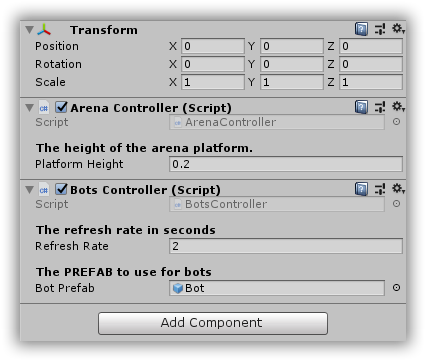
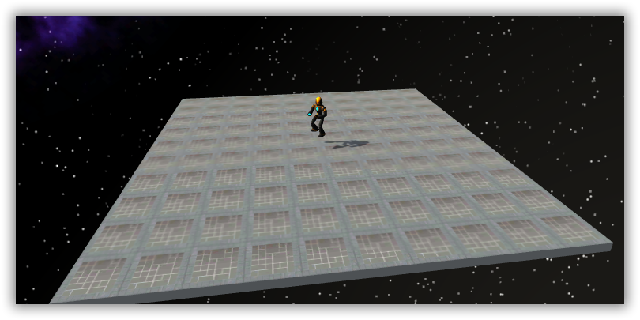
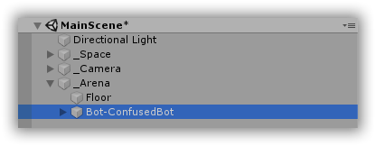

# CSharpWars


[Return to README](https://github.com/Djohnnie/CSharpWars-NDCLondon-2020)

[Return to step 6](https://github.com/Djohnnie/CSharpWars-NDCLondon-2020/blob/master/workshop/step06/step.md)

## Step 7

Now that we have a robot in the database, we can go back to our Unity editor to make the robot appear on the arena.

In your project overview window you should see a folder called *Prefabs* and within this folder an object called *Bot*. A prefab is actually a blueprint of an object you want to reuse in your game. If you look at our scene you can see that the scene contains a number of game objects that are already there. There is a camera, a light source and a cube. These items are quite static, they are always there, they never need to spawn or despawn from the game. This is why I decided to put them directly in the scene. The bot only needs to spawn if it is created and it needs to despawn if it dies. There can also be more than one instance at the same time. This is why I prepared it as a prefab.

Before actually spawning robots on the arena, we are going to go to our frontend scripts in Visual Studio 2017 and you should look for the *BotsController.cs* script. This script will control the actively tracked robots in the game.

Add the following code to this script:

```c#
public class BotsController : MonoBehaviour
{
    private readonly Dictionary<Guid, BotController> _bots = new Dictionary<Guid, BotController>();

    [Header("The refresh rate in seconds")]
    public float RefreshRate = 2;

    [Header("The PREFAB to use for bots")]
    public GameObject BotPrefab;


    void Start()
    {
        InvokeRepeating(nameof(RefreshBots), RefreshRate, RefreshRate);
    }

    private void RefreshBots()
    {
        var bots = ApiClient.GetBots();

        foreach (var bot in bots)
        {
            if (!_bots.ContainsKey(bot.Id))
            {
                var newBot = Instantiate(BotPrefab);
                newBot.transform.parent = transform;
                newBot.name = $"Bot-{bot.Name}";
                var botController = newBot.GetComponent<BotController>();
                _bots.Add(bot.Id, botController);
            }
        }
    }
}
```

The method *GetBots* on the *ApiClient* is not available because you need to add it to the *ApiClient.cs* script file.

```c#
public static List<Bot> GetBots()
{
    return Get<List<Bot>>("bots");
}
```

So, as the *Start* method is called when the game begins: a method called *RefreshBots* will be called every two seconds. This *RefreshBots* method will get a list of all bots from our WebApi backend and keep them in a dictionary based on their *Id*. Thanks to the *BotPrefab*, which we will link to this script later, we can create instances of these bot objects and set their properties. We are setting their transform parent and name so we can see them turn up in the scene hierarchy while we are running the game.

Go to the Unity editor and click the *_Arena* game object in the *Hierachy* window. Add the *BotsController* script as a component to this game object by using the *Inspector* window. There should be *2* in the *RefreshRate* property and the *BotPrefab* property will still be empty. This *BotPrefab* property gives you the opportunity to link the bot prefab to your script. Just drag the bot prefab from the *Prefabs* directory in your *Project* window to the *BotPrefab* property in the *Inspector* window. The result should look like the following print-screen:



If you now press the play button in the top. The arena should be sized correctly and your single robot should appear after some time.



Also, in the scene hierarchy, if you expand the *_Arena* game object you can see the *Floor* object (which is the transformed cube) and your prefab instance representing your robot.




[Continue to step 8](https://github.com/Djohnnie/CSharpWars-NDCLondon-2020/blob/master/workshop/step07/step.md)