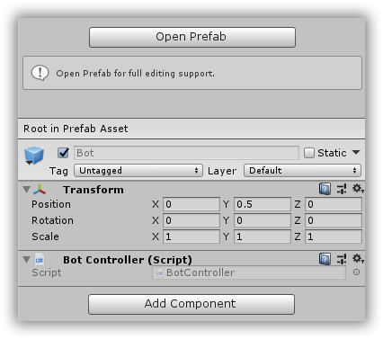

# CSharpWars


[Return to README](https://github.com/Djohnnie/CSharpWars-NDCLondon-2020)

[Return to step 7](https://github.com/Djohnnie/CSharpWars-NDCLondon-2020/blob/master/workshop/step07/step.md)

## Step 8

Since we just created an instance of the *Bot* prefab, it is not positioned correctly. Find the *BotController.cs* file and add the following code to it:

```c#
public class BotController : MonoBehaviour
{
    private Bot _bot;
    private ArenaController _arenaController;

    public void SetArenaController(ArenaController arenaController)
    {
        _arenaController = arenaController;
    }

    public void SetBot(Bot bot)
    {
        _bot = bot;
    }

    public void InstantRefresh()
    {
        if (_bot == null) return;

        transform.position = _arenaController.ArenaToWorldPosition(_bot.X, _bot.Y);
        transform.eulerAngles = OrientationVector.CreateFrom(_bot.Orientation);
    }
}
```

This controller will control a single bot on the arena. It has some helper method like *SetArenaController* and *SetBot* to set a reference to the bot object for state information and the arena controller for world information. The *InstantRefresh* method will position the robot on the arena based on its X and Y coordinates and rotate it based on its orientation.

The *ArenaToWorldPosition* does not exist on the *ArenaController* so add it like this:

```c#
public Vector3 ArenaToWorldPosition(int x, int y)
{
    if (_arena != null && _floor != null)
    {
        return new Vector3(
            .5f + x - _arena.Width / 2 + _floor.transform.position.x,
            PlatformHeight / 2,
            _arena.Height - .5f - y - _arena.Height / 2 + _floor.transform.position.z);
    }

    return Vector3.zero;
}
```

Now update the *BotsController* to call these methods to prepare the robot correctly:

```c#
public class BotsController : MonoBehaviour
{
    private readonly Dictionary<Guid, BotController> _bots = new Dictionary<Guid, BotController>();
    private ArenaController _arenaController;

    [Header("The refresh rate in seconds")]
    public float RefreshRate = 2;

    [Header("The PREFAB to use for bots")]
    public GameObject BotPrefab;


    void Start()
    {
        _arenaController = GetComponent<ArenaController>();
        InvokeRepeating(nameof(RefreshBots), RefreshRate, RefreshRate);
    }

    private void RefreshBots()
    {
        var bots = ApiClient.GetBots();

        foreach (var bot in bots)
        {
            if (!_bots.ContainsKey(bot.Id))
            {
                var newBot = Instantiate(BotPrefab);
                newBot.transform.parent = transform;
                newBot.name = $"Bot-{bot.Name}";
                var botController = newBot.GetComponent<BotController>();
                botController.SetBot(bot);
                botController.SetArenaController(_arenaController);
                botController.InstantRefresh();
                _bots.Add(bot.Id, botController);
            }
        }
    }
}
```

Because each robot needs to have an instance of the *BotController* script, we can link it using the *Inspector* window in the Unity editor. Click the *Bot* prefab object in the *Project* window and add the *BotController* as a component in the *Inspector* window.



If you press the play button in the top, you should see that the bot is now correctly positioned and rotated.


[Continue to step 9](https://github.com/Djohnnie/CSharpWars-NDCLondon-2020/blob/master/workshop/step09/step.md)