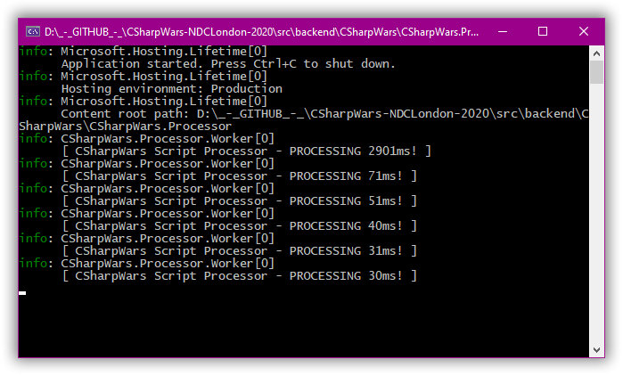

# CSharpWars


[Return to README](https://github.com/Djohnnie/CSharpWars-NDCLondon-2020)

[Return to step 9](https://github.com/Djohnnie/CSharpWars-NDCLondon-2020/blob/master/workshop/step09/step.md)

## Step 10

The moves that can be performed by the robot are coded in seperate classes so we can implement and test them easily.

Find the *TurnLeft.cs* file in the *Moves* folder and add the following code to its *Go* method:

```c#
public override BotResult Go()
{
    // Build result based on current properties.
    var botResult = new BotResult(BotProperties)
    {
        Move = PossibleMoves.TurningLeft
    };

    botResult.Orientation = BotProperties.Orientation switch
    {
        PossibleOrientations.North => PossibleOrientations.West,
        PossibleOrientations.East => PossibleOrientations.North,
        PossibleOrientations.South => PossibleOrientations.East,
        PossibleOrientations.West => PossibleOrientations.South,
        _ => botResult.Orientation
    };

    return botResult;
}
```

Based on its current orientation, a new orientation, 90° to the left, will be set for the *BotProperties* object.

Find the *TurnRight.cs* file in the *Moves* folder and add the following code to its *Go* method:

```c#
public override BotResult Go()
{
    // Build result based on current properties.
    var botResult = new BotResult(BotProperties)
    {
        Move = PossibleMoves.TurningRight
    };

    botResult.Orientation = BotProperties.Orientation switch
    {
        PossibleOrientations.North => PossibleOrientations.East,
        PossibleOrientations.East => PossibleOrientations.South,
        PossibleOrientations.South => PossibleOrientations.West,
        PossibleOrientations.West => PossibleOrientations.North,
        _ => botResult.Orientation
    };

    return botResult;
}
```

Based on its current orientation, a new orientation, 90° to the right, will be set for the *BotProperties* object.

Find the *TurnAround.cs* file in the *Moves* folder and add the following code to its *Go* method:

```c#
public override BotResult Go()
{
    // Build result based on current properties.
    var botResult = new BotResult(BotProperties)
    {
        Move = PossibleMoves.TurningAround
    };

    botResult.Orientation = BotProperties.Orientation switch
    {
        PossibleOrientations.North => PossibleOrientations.South,
        PossibleOrientations.East => PossibleOrientations.West,
        PossibleOrientations.South => PossibleOrientations.North,
        PossibleOrientations.West => PossibleOrientations.East,
        _ => botResult.Orientation
    };

    return botResult;
}
```

Based on its current orientation, a new orientation, 180° around, will be set for the *BotProperties* object.

Find the *WalkForward.cs* file in the *Moves* folder and add the following code to it:

```c#
public override BotResult Go()
{
    // Build result based on current properties.
    var botResult = new BotResult(BotProperties);

    // Only perform move if enough stamina is available.
    if (BotProperties.CurrentStamina - STAMINA_ON_MOVE >= 0)
    {
        var destinationX = BotProperties.X;
        var destinationY = BotProperties.Y;

        switch (BotProperties.Orientation)
        {
            case PossibleOrientations.North:
                destinationY--;
                break;
            case PossibleOrientations.East:
                destinationX++;
                break;
            case PossibleOrientations.South:
                destinationY++;
                break;
            case PossibleOrientations.West:
                destinationX--;
                break;
        }

        if (!WillCollide(destinationX, destinationY))
        {
            botResult.CurrentStamina -= STAMINA_ON_MOVE;
            botResult.Move = PossibleMoves.WalkForward;
            botResult.X = destinationX;
            botResult.Y = destinationY;
        }
    }

    return botResult;
}

private bool WillCollide(int x, int y)
{
    var collidingEdge = x < 0 || x >= BotProperties.Width || y < 0 || y >= BotProperties.Height;
    var collidingBot = BotProperties.Bots.FirstOrDefault(b => b.X == x && b.Y == y);
    return collidingBot != null || collidingEdge;
}
```

Only if the remaining stamina allows it, the X and Y coordinates will change based on the current orientation. This change will only occur if the robot is not colliding with the edges of the arena or with another robot.

Running the *CSharpWars.Processor* project right now will cause it to iterate every two seconds:



The first iteration takes a lot of time because the script has to be compiled. The next iterations are easier since the scripts only need to be run.

You can let the backend WebApi and the script processor run while you work on the next steps.


[Continue to step 11](https://github.com/Djohnnie/CSharpWars-NDCLondon-2020/blob/master/workshop/step11/step.md)